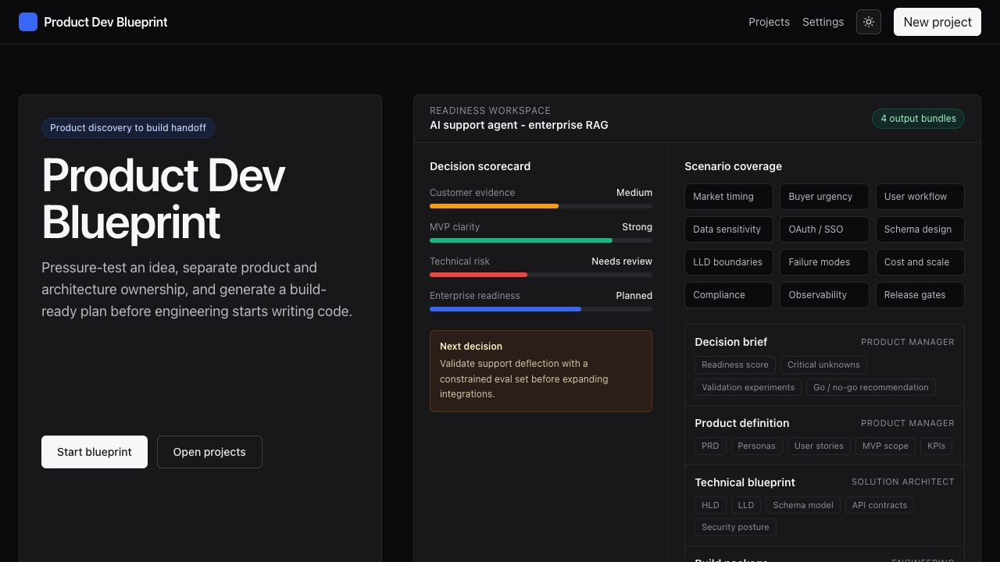
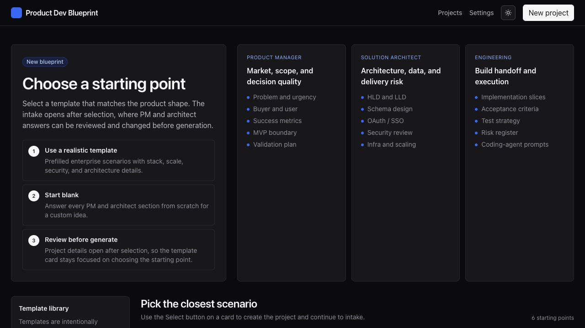
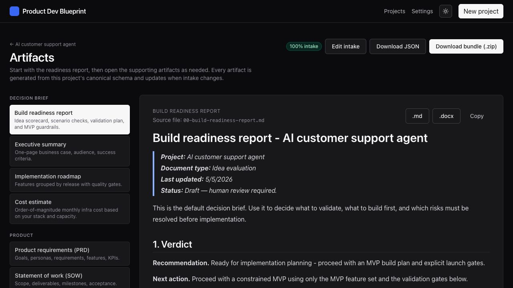
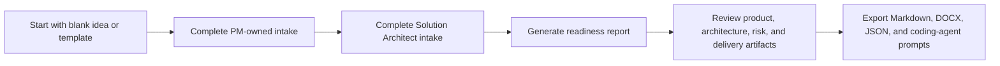
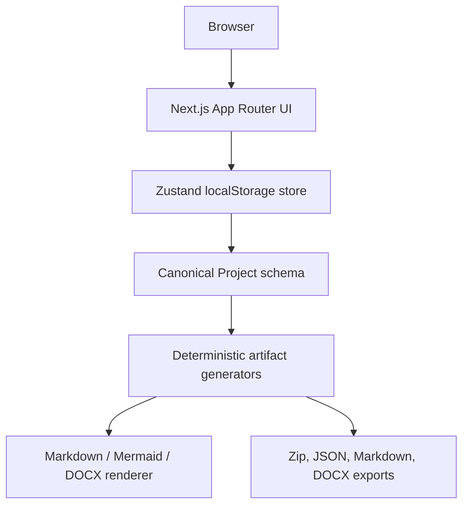

# Product Dev Blueprint

> **Production:** [product-dev-blueprint.vercel.app](https://product-dev-blueprint.vercel.app)

[](https://github.com/Abby263/product-dev-blueprint/actions/workflows/ci.yml)
[](LICENSE)

Product Dev Blueprint is a schema-first product planning application for turning a rough software idea into a focused build-readiness plan. It helps a Product Manager, Solution Architect, founder, or engineering lead pressure-test an idea before development starts, then generates a traceable artifact bundle that can be handed to an engineering team or coding agent.

The current production application is a client-side Next.js app with deterministic artifact generation. It does not require model API keys, auth, a database, or a backend service to run.

## UI Demo

There is no recorded demo video checked into the repo yet. Instead, this README includes a screenshot-based demo captured from the current production UI. The assets live in [`docs/assets`](docs/assets) and can be replaced by a real video later.

### 1. Start From The Decision Workspace

The landing page now presents the product as a decision and readiness workspace, not as a large pile of documents. It highlights the scorecard, scenario coverage, product ownership, architecture ownership, and build handoff groups.



### 2. Choose A Starting Template

The new-project page separates responsibility between Product Manager, Solution Architect, and Engineering. Template cards show stack direction, cloud, auth, data model, architecture pattern, governance, compliance, and scale signals.



### 3. Review Generated Artifacts

After selecting a template, the app creates a project, marks the seeded intake complete, and opens generated artifacts. The readiness report is the default artifact; supporting documents are grouped for product, architecture, delivery, and governance review.



## Product Goals

Product Dev Blueprint is designed to answer four questions before a team commits engineering time:

1. **Should we build this?** Validate the problem, market, user, buyer, urgency, and confidence level.
2. **What can break this?** Surface operational, legal, security, data, scale, AI, and adoption risks early.
3. **What should the MVP contain?** Convert the idea into a constrained build slice with validation gates.
4. **How should engineering build it?** Produce HLD, LLD, schema, APIs, security posture, roadmap, tests, and coding-agent prompts.

## Target Users

- Product Managers defining PRDs and MVP scope
- Founders validating a SaaS or marketplace idea
- Business Analysts converting business concepts into implementation-ready detail
- Solution Architects designing HLD, LLD, schema, APIs, auth, and deployment topology
- Engineering Managers estimating risk and sequencing delivery
- Pre-sales and transformation teams creating client-facing solution blueprints
- Developers using Cursor, Codex, or similar tools to build from structured specs

## Current Runtime Status

| Area | Current implementation |
|---|---|
| UI | Next.js 14 App Router, React, TypeScript, Tailwind CSS |
| Persistence | Browser `localStorage` through Zustand |
| Artifact generation | Deterministic TypeScript generators in `src/lib/generators` |
| HLD / LLD | Generated from user inputs through the system-design generator |
| Mermaid diagrams | Rendered as visual diagrams in generated architecture artifacts |
| Exports | Markdown, DOCX, JSON, and zip bundle |
| Auth | Not implemented |
| Backend database | Not implemented |
| Live LLM calls | Not implemented in the current runtime |
| DeepAgents | Planned server-side integration path documented, not wired at runtime |

Required runtime environment variables today: **none**. See [`SETUP.md`](SETUP.md) for current and future API key guidance.

## Core Workflow



## Capabilities

### Idea Evaluation

- Problem, audience, buyer, market timing, alternatives, differentiation, pricing, and success criteria
- Build-readiness scorecard across desirability, feasibility, viability, risk readiness, and decision confidence
- Critical gaps and assumptions that should block or narrow implementation
- Validation experiments and MVP guardrails

### PM-Owned Product Planning

- Personas and jobs-to-be-done
- Functional and non-functional requirements
- Feature backlog with acceptance criteria, edge cases, security notes, audit needs, dependencies, and release grouping
- KPI and success-measure definition
- Marketing and GTM brief
- SOW and executive summary outputs

### Solution Architecture Planning

- High-level architecture and low-level architecture
- Schema design and domain modeling
- API contract notes and integration boundaries
- OAuth, SSO, RBAC, authorization, tenancy, and audit posture
- Infra, cloud services, networking, CI/CD, Terraform/IaC, observability, DR, scaling, and release gates
- Architecture tradeoff matrix covering build-vs-buy, events, caching, realtime, privacy, security, data residency, and operational risk

### AI Product Planning

For AI use cases, the app captures:

- Agent framework direction, including LangGraph and DeepAgents
- RAG pipeline, vector database, embeddings, retrieval, evals, and guardrails
- Prompt-injection and AI safety review areas
- Model observability and tracing options
- Human-in-the-loop escalation and approval flows
- Future DeepAgents content-writer architecture, with server-side memory, skills, and subagents

### Export And Handoff

- Download individual `.md` or `.docx` artifacts
- Download full bundle as `.zip`
- Download raw `project.json`
- Copy markdown directly from the artifact viewer
- Use coding-agent prompts as structured input for Cursor, Codex, Lovable, Replit, or other development tools

## Generated Artifact Bundle

The app does generate a large supporting bundle, but the UI and README intentionally group it by outcome so users do not experience it as a wall of documents.

| Group | Artifacts |
|---|---|
| Decision brief | Build readiness report, executive summary, implementation roadmap, cost estimate |
| Product definition | PRD, SOW, marketing/GTM brief |
| Architecture blueprint | Engineering specification, architecture blueprint, AI architecture, data/interface spec, ADR pack |
| Delivery package | Feature specification, requirements traceability matrix, test strategy, launch/operations plan |
| Governance | Risk register, security/compliance checklist |
| Coding handoff | Coding-agent prompt pack and scaffold bundle |

Stable IDs are assigned across the project schema and reused in generated artifacts:

```text
FR-001, NFR-001, FEAT-001, ADR-001, RISK-001, ASM-001,
Q-001, INT-001, ENT-001, SLO-001, KPI-001
```

## Architecture Overview

The shipped app is intentionally simple and frontend-only. This makes it easy to run, demo, and deploy while the product workflow is still being refined.



Future server-side capabilities such as accounts, shared projects, background generation, and DeepAgents content writing should be added behind server APIs or workers. Provider keys must never be exposed to browser bundles.

## Tech Stack

| Layer | Technology |
|---|---|
| Framework | Next.js 14 App Router |
| Language | TypeScript |
| UI | React, Tailwind CSS |
| State | Zustand with browser persistence |
| Markdown | `react-markdown`, `remark-gfm` |
| DOCX export | `docx` |
| Zip export | `jszip` |
| Deployment | Vercel |
| CI | GitHub Actions |

## Local Development

Prerequisites:

- Node.js 20 or newer
- npm
- Optional: Vercel CLI for manual deployments

Install and run:

```bash
nvm use
npm install
npm run dev
```

Open:

```text
http://localhost:3000
```

Run production checks:

```bash
npm run typecheck
npm run build
```

Scripts:

| Script | Purpose |
|---|---|
| `npm run dev` | Start the local Next.js dev server |
| `npm run build` | Build the production app |
| `npm run start` | Serve the built app locally |
| `npm run typecheck` | Run TypeScript without emitting files |
| `npm run lint` | Legacy lint command; see `SETUP.md` before relying on it |

## Environment Variables

No `.env.local` file is required for the current application.

Do not add model keys such as `OPENAI_API_KEY`, `ANTHROPIC_API_KEY`, or `LANGSMITH_API_KEY` unless a server-side generation runtime is added. If DeepAgents or live model generation is implemented later, use server-only variables and never expose them through `NEXT_PUBLIC_*`.

See [`SETUP.md`](SETUP.md) for:

- Current runtime requirements
- Future DeepAgents variables
- Vercel deployment variables
- Auth/database variables for a future multi-user version
- Troubleshooting notes

## Deployment

Production runs on Vercel through the GitHub integration.

| Event | Result |
|---|---|
| Pull request opened | Vercel preview deployment |
| Push to PR branch | Preview redeploy |
| Merge to `main` | Production deployment |
| GitHub Actions | Type-check and production build |

Production URL:

```text
https://product-dev-blueprint.vercel.app
```

Manual production deploy from a linked and authenticated machine:

```bash
npx vercel deploy --prod --yes
```

## Project Structure

```text
.github/
  workflows/ci.yml                  # Type-check and build
  dependabot.yml                    # Dependency update checks
  pull_request_template.md
docs/
  assets/                           # README demo screenshots
src/
  app/
    page.tsx                        # Landing page
    settings/page.tsx               # Import/export/clear settings
    projects/
      page.tsx                      # Project dashboard
      new/page.tsx                  # Template selection
      [id]/page.tsx                 # Project overview
      [id]/intake/page.tsx          # Guided intake wizard
      [id]/artifacts/page.tsx       # Generated artifacts and export actions
  components/
    ui.tsx                          # Shared UI primitives
    ThemeToggle.tsx                 # Theme switcher
    MermaidDiagram.tsx              # Mermaid rendering and enlarge view
    wizard/
      WizardShell.tsx               # Wizard layout, progress, navigation
      steps.tsx                     # Core intake steps
      steps-extended.tsx            # Platform, features, system design, AI, compliance
  lib/
    schema.ts                       # Canonical Project type
    store.ts                        # Zustand store and localStorage persistence
    ids.ts                          # Stable ID allocation
    options.ts                      # Intake option catalog and guidance
    architecture-scenarios.ts       # Tradeoff and architecture scenario catalog
    feature-suggestions.ts          # Rule-based feature seeding
    scaffold.ts                     # Stack-aware scaffold export
    docx.ts                         # Markdown to DOCX rendering
    export.ts                       # Zip and JSON export helpers
    generators/                     # Deterministic artifact generators
```

## Data And Privacy Notes

- Projects are stored in the browser only.
- Data is not synchronized across devices or users.
- Clearing browser/site data can delete local projects.
- There is no server-side backup in the current implementation.
- Generated artifacts are drafts and should be reviewed before use in production delivery.

For a production multi-user version, add auth, a database, server-side exports, access controls, audit logs, and backup/retention policies before storing real customer or regulated data.

## Quality Gates

Before merging:

```bash
npm run typecheck
npm run build
```

CI runs the same required checks on pull requests and pushes to `main`.

## Roadmap

Near-term product improvements:

- Persist projects server-side with accounts and shared workspaces
- Add version history, comments, and review workflow
- Add live DeepAgents-based content writer generation behind a server runtime
- Add uploaded context documents for deeper artifact generation
- Add richer diagram export options
- Add Linear/Jira/GitHub issue export
- Add team roles for Product Manager, Solution Architect, Engineering, Security, and Reviewer

The current app keeps these capabilities out of the browser until a secure server-side runtime is introduced.

## Contributing

1. Branch from `main`.
2. Make focused changes.
3. Run `npm run typecheck` and `npm run build`.
4. Open a pull request.
5. Merge after CI and preview deployment pass.

## License

This repository is licensed under the [PolyForm Noncommercial License 1.0.0](LICENSE).

Commercial use is not permitted under this license. Any commercial use, including resale, SaaS hosting, paid client work, embedding this repository in a paid product, or using it to provide paid services, requires separate written permission from the copyright holder. See [COMMERCIAL.md](COMMERCIAL.md) for the repository's commercial-use notice.

This is a source-available non-commercial license, not an OSI open-source license. AGPL was not used because AGPL permits commercial use when its license conditions are followed.
